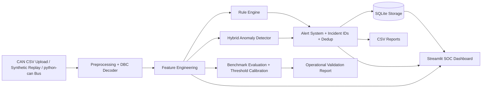

# System Architecture

## Runtime Modes

- **Local analyst mode:** auth on, persistence on, full storage controls visible.
- **Public demo mode:** set `VEHICULAR_IDS_PUBLIC_DEMO=true`; auth is disabled,
  persistence defaults to read-only, and destructive storage controls are hidden.
- **Live bus mode:** use the dashboard `Live Stream` tab with a python-can
  interface such as `vcan0` / `socketcan`.
